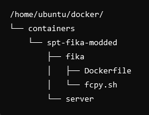

# Setting up Fika SPT server with docker for Ubuntu on Oracle Cloud ARM instance
Last updated: 02/07/2024 | Dildz

**Make sure your oracle instance is 64-bit! Arm64 works too!**

[For support you should join the Fika Discord server](https://discord.gg/project-fika)

## Table Of Contents

[Installation](https://github.com/Dildz/SPT-Fika-modded--Docker-Guide#installing-docker)

[Updating The Server](https://github.com/Dildz/SPT-Fika-modded--Docker-Guide#updating-to-newer-versions)

[Other Possibly Helpful Info](https://github.com/Dildz/SPT-Fika-modded--Docker-Guide#modding-and-other-possibly-helpful-info)

## Free VPS

[A good free VPS from Oracle. It offers 24gb ram, 4 cores and 200gb of storage. It's ARM but works with this setup.](https://www.oracle.com/cloud/free/)

## Installing Docker

First of all you need Docker. [You can download it by following this guide here.](https://docs.docker.com/engine/install/ubuntu/)
This guide is for ubuntu but you can find guides for other operating systems/distributions on their website.

You can verify your Docker installation by running `docker --version`

## Creating a working folder for docker

Create a new docker folder in the ubuntu home folder.

```
mkdir docker
cd docker
```

## Setting up the directories

After you've got docker installed you can start by creating a new directory for your project and navigate to it in your terminal.

We're going to go ahead and create a new directory called "containers" and navigate to it.
You can do this with:

```
mkdir containers
cd containers
```

We're going to go ahead and create a new directory called "spt-fika-modded" and navigate to it.
You can do this with:

```
mkdir spt-fika-modded
cd spt-fika-modded
```

We're going to create a new directories for our Fika Dockerfile and Fika SPT server and navigate to the Dockerfile directory.
You can do this with:

```
mkdir fika
mkdir server
cd fika
```

The file structure looks like this:



## Cloning the GitHub repository

Now we're going to clone the SPT-Fika-modded--Docker-Guide [(This is a fork, original from OnniSaarni Docker Guide)](https://github.com/OnniSaarni/SPT-Fika-Docker-Guide)
First we create a github-repos directory.

You can do this with:

```
cd ~
mkdir github-repos
```

Then we clone the repository.

you can do this with:

```
git clone https://github.com/Dildz/SPT-Fika-modded--Docker-Guide.git
```

## Copying the files

Now we're going to copy the files from SPT-Fika-modded--Docker-Guide to the docker container location.

You can do this with:

```
cp /home/ubuntu/github-repos/SPT-Fika-modded--Docker-Guide/files/Dockerfile /home/ubuntu/docker/containers/spt-fika-modded/fika/
cp /home/ubuntu/github-repos/SPT-Fika-modded--Docker-Guide/files/fcpy.sh /home/ubuntu/docker/containers/spt-fika-modded/fika/
cp /home/ubuntu/github-repos/SPT-Fika-modded--Docker-Guide/files/restart_fika.sh /home/ubuntu/docker/containers/spt-fika-modded/fika/
```

You will now have the Dockerfile, fcpy.sh and restart_fika.sh copied to the spt-fika-modded/fika/ folder.
You can change the Fika and SPT versions If SPT or FIKA gets updated.
In the `Dockerfile` you can change `FIKA_BRANCH` and `SPT_BRANCH` args to the version you want. E.g. `ARG SPT_BRANCH=3.8.1` can be changed to `ARG SPT_BRANCH=3.8.3`.

## Setting up the Docker container

After the files have been copied we can start the setup.

First off we're going to run this in the "fika" directory:

```
cd /home/ubuntu/docker/containers/spt-fika-modded/fika
docker build --no-cache --label modded-fika -t modded-fika .
```

It will take a while but once it is finished we are going to move on to the next command. 

**In the next command need to change to the server directory path.**
You can navigate to the "server" directory by running:

```
cd ..
cd server
```

Then we will run the container with the following command:

```
docker run --pull=never -v /home/ubuntu/docker/containers/spt-fika-modded/server:/opt/server -v /home/ubuntu/docker/logs:/home/ubuntu/docker/logs -p 6969:6969 -p 6970:6970 -p 6971:6971 -it --name modded-fika --log-opt max-size=10m --log-opt max-file=3 modded-fika

```

## Copying the "mod-pack"
List of mods used in this "mod-pack" [(Google Doc Link)](https://docs.google.com/document/d/12jq1-nWixf5p0ye7Foqhjgr9OFkqzGVUvVqVjPdHG14?usp=drive_fs)
Once the run command has completed successfully - we can run the modscpy.sh script as sudo to copy the mod-pack:

```
sudo /home/ubuntu/github-repos/SPT-Fika-modded--Docker-Guide/files/modscpy.sh
```

## Starting the container
Start the container using the restart.sh script in the fika folder.

```
sudo /home/ubuntu/docker/containers/spt-fika-modded/fika/restart_fika.sh
```

After the first run after the setup - run the following command to update the restart status.

```
docker update --restart unless-stopped modded-fika
```

Then run the following command to change the permissions for the profiles folder.

```
sudo chown -R ubuntu:ubuntu /home/ubuntu/docker/containers/spt-fika-modded/server/user/profiles
sudo chmod -R 775 /home/ubuntu/docker/containers/spt-fika-modded/server/user/profiles

sudo chown -R ubuntu:ubuntu /home/ubuntu/docker/containers/spt-fika-modded/server/user/mods
sudo chmod -R 775 /home/ubuntu/docker/containers/spt-fika-modded/server/user/mods
```

After starting the container you can see the logs with `docker logs modded-fika -f`
Logs can also be accessed in the /home/ubuntu/docker/logs folder for further processing with a discord bot (for example).
The modded-fika logs are cleared on docker restart as per the restart_fika.sh script.

## Starting mods for new players

Any new players to the modded-fika server will need to have a fresh SPT install with the following mods pre-installed before connecting:

[(FIKA client & server)](https://github.com/project-fika/Fika-Plugin/releases/)

[(Corter-ModSync)](https://github.com/c-orter/modsync)

Download & install both mods to the SPT install folder before connecting to the modded-fika server - the client & server mods!!

## Helpful Docker commands

To see the logs of the container:

```
docker logs modded-fika -f
```
You can use **Ctrl + C** to exit the logs.

To stop the container:

```
docker stop modded-fika
```

To start or restart the container:

```
sudo /home/ubuntu/docker/containers/spt-fika-modded/fika/restart_fika.sh
```

## Updating to newer versions

First off you will have to stop the server with:

```
docker stop modded-fika
```

[How to find out your server directory path](https://gist.github.com/OnniSaarni/a3f840cef63335212ae085a3c6c10d5c#setting-up-the-docker-container)
-- see ahandleman's comment re: bash script to backup mods/profiles & updating

It is recommended to backup your profiles in your server/user/profiles directory and the mods in your server/mods directory.
You can copy them to your container backup directory with these commands:

```
cp -r /home/ubuntu/docker/containers/spt-fika-modded/server/user/profiles /home/ubuntu/docker/containers/spt-fika-modded-backup
```
```
cp -r /home/ubuntu/docker/containers/spt-fika-modded/server/user/mods /home/ubuntu/docker/containers/spt-fika-modded-backup
```

Next we need to delete the container and the image. We can do that by running these commands one at a time:

```
docker rm modded-fika
```
```
docker rmi modded-fika
```
```
docker images
```
```
docker image prune
```
```
sudo rm -rf /home/ubuntu/docker/containers/spt-fika-modded/server/*
```

After that we need to rebuild the container:

```
cd /home/ubuntu/docker/containers/spt-fika-modded/fika
```
```
docker build --no-cache --label modded-fika -t modded-fika .
```

And then we can start it back up with: [REMEMBER TO CHANGE PATHTOYOURSERVERFILE](https://gist.github.com/OnniSaarni/a3f840cef63335212ae085a3c6c10d5c#setting-up-the-docker-container)

```
cd ..
cd server
```
```
docker run --pull=never -v /home/ubuntu/docker/containers/spt-fika-modded/server:/opt/server -v /home/ubuntu/docker/logs:/home/ubuntu/docker/logs -p 6969:6969 -p 6970:6970 -p 6971:6971 -it --name modded-fika --log-opt max-size=10m --log-opt max-file=3 modded-fika
```
```
sudo /home/ubuntu/vscode/github-repos/SPT-Fika-modded--Docker-Guide/files/modscpy.sh
```

Then run the following command to change the permissions for the profiles and mods folders.

```
sudo chown -R ubuntu:ubuntu /home/ubuntu/docker/containers/spt-fika-modded/server/user/profiles
sudo chmod -R 775 /home/ubuntu/docker/containers/spt-fika-modded/server/user/profiles

sudo chown -R ubuntu:ubuntu /home/ubuntu/docker/containers/spt-fika-modded/server/user/mods
sudo chmod -R 775 /home/ubuntu/docker/containers/spt-fika-modded/server/user/mods
```

Now you can restore any backed up profiles.
Once profiles are restored, start the server with:

```
sudo /home/ubuntu/docker/containers/spt-fika-modded/fika/restart_fika.sh
```
```
docker update --restart unless-stopped modded-fika
```

Now your server is updated.

[To update your client you can follow the instructions here.](https://dev.sp-tarkov.com/SPT/Stable-releases/releases) [You will also need to download the newest Fika plugin from here.](https://github.com/project-fika/Fika-Plugin/releases)

## Modding and other possibly helpful info

To play with your friends you first have to port forward or disable the firewall for port 6969 on the server.

To host Co-Op raids with your friends you either have to have UPnP enabled or have port 25565 forwarded to your PC. 
You should also disable the firewall for the EscapeFromTarkov.exe and allow ports in the firewall. [More info over here](https://github.com/project-fika/Fika-Documentation?tab=readme-ov-file#installation)

To add more mods to the game you have to add them to the "users" directory in the server directory.

http.json should be pre configured for portforwarding in this setup.

[You might also want to look into making automatic backups with cron.](https://unix.stackexchange.com/a/16954)
It's not necessary but it's a plus. I'm not going to go into it in depth but if someone wants they are free to make a simple guide for it.

## Errors

[If you're having this error and you have installed the realism mod, you have to do this fix:](https://github.com/space-commits/SPT-Realism-Mod-Server/pull/42)

```
[2024-05-03T03:21:21.203Z] error:     TypeError: Cannot read properties of undefined (reading 'replaceAll')
[2024-05-03T03:21:21.204Z] error:     TypeError: Cannot read properties of undefined (reading 'replaceAll')
[2024-05-03T03:21:21.204Z] error:     TypeError: Cannot read properties of undefined (reading 'replaceAll')
    at HttpRouter.getResponse (/opt/server/user/mods/mpt-server/src/overrides/routers/HttpRouter.ts:29:41)
    at AkiHttpListener.getResponse (/snapshot/src/servers/http/AkiHttpListener.ts:150:38)
    at AkiHttpListener.handle (/snapshot/src/servers/http/AkiHttpListener.ts:39:39)
    at HttpServer.handleRequest (/snapshot/src/servers/HttpServer.ts:103:26)
    at Server.<anonymous> (/snapshot/src/servers/HttpServer.ts:45:18)
    at Server.emit (node:events:518:28)
    at parserOnIncoming (node:_http_server:1151:12)
    at HTTPParser.parserOnHeadersComplete (node:_http_common:119:17)
[2024-05-03T03:21:21.203Z] error:     TypeError: Cannot read properties of undefined (reading 'replaceAll')
    at HttpRouter.getResponse (/opt/server/user/mods/mpt-server/src/overrides/routers/HttpRouter.ts:29:41)
    at AkiHttpListener.getResponse (/snapshot/src/servers/http/AkiHttpListener.ts:150:38)
    at AkiHttpListener.handle (/snapshot/src/servers/http/AkiHttpListener.ts:39:39)
    at HttpServer.handleRequest (/snapshot/src/servers/HttpServer.ts:103:26)
    at Server.<anonymous> (/snapshot/src/servers/HttpServer.ts:45:18)
    at Server.emit (node:events:518:28)
    at parserOnIncoming (node:_http_server:1151:12)
    at HTTPParser.parserOnHeadersComplete (node:_http_common:119:17)
```

I was also having an error which was fixed by deleting all the files in the "cache" directory.

A lot of the errors can be fixed by just searching the Fika Discord server for the error.

## Credits

Thanks to @MonstraG and @lommy7 for helping others in the comments and providing fixes.

[Special thanks to k2rlxyz for making the original Dockerfile.](https://hub.docker.com/r/k2rlxyz/fika) It can also be found in the [Discord](https://discord.gg/project-fika).
