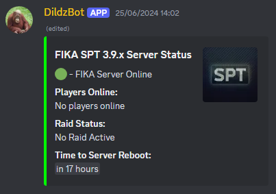

# Setting up Fika SPT server with docker for Ubuntu on Oracle Cloud ARM instance
Last updated: 05/09/2024 | Dildz

**Make sure your oracle instance is 64-bit! Arm64 works too!**

[For support you should join the Fika Discord server](https://discord.gg/project-fika)

## Table Of Contents
[Installation](https://github.com/Dildz/SPT-Fika-modded--Docker-Guide#installing-docker)

[Updating The Server](https://github.com/Dildz/SPT-Fika-modded--Docker-Guide#updating-to-newer-versions)

[Other Possibly Helpful Info](https://github.com/Dildz/SPT-Fika-modded--Docker-Guide#modding-and-other-possibly-helpful-info)

## Free VPS
[A good free VPS from Oracle. It offers 24GB RAM, 4 CPU cores and 200GB of storage. It's ARM but works with this setup.](https://www.oracle.com/cloud/free/)

If you decide to create & use an Oracle ARM VPS - I recommend installing/setting up [ZeroTier One](https://www.zerotier.com/download/) on the server, & in the Oracle Dashboard - remove all existing firewall rules & create one rule that allows all traffic from **ONLY** the ZeroTier One IP range that you would have created.

In my opinion this is a secure & easy way for you to SSH into your server and for players to connect to the FIKA server while blocking any unwanted public traffic. Only people that you approve & assign an IP to on the ZeroTier dashboard will be able to connect.

Install the ZeroTier client on a SSH client, join the ZT network & use the server's ZT IP & your Oracle SSH key to connect to the server.

If you are using a different VPS host or are self-hosting - either use your providers dashboard to allow all traffic from ZT or use something like UFW to add an allow all firewall rule for the ZT network.

## Recommended tools
SSH: [Putty](https://www.chiark.greenend.org.uk/~sgtatham/putty/latest.html)

File Explorer: [WinSCP](https://winscp.net/eng/download.php)

My personal recommendation: [VSCode](https://code.visualstudio.com/download) with the Remote Explorer extension installed.

VSCode Oracle SSH config file example:
```
Host OracleVM-ubuntu
  HostName 10.147.18.XXX
  User ubuntu
  IdentityFile "PATH\TO\YOUR\SSH-KEY"
```
Where Hostname is your server's assigned ZT IP & IdentityFile is the SSH key file-path you would have saved to when creating the server.

**DON"T LOOSE YOUR SSH KEY FILE!!!** Without this you won't be able to connect to your Oracle server - keep it somewhere **SAFE**

## Installing Docker
First of all you need Docker. [Official setup guide here.](https://docs.docker.com/engine/install/ubuntu/)

This guide is for ubuntu but you can find guides for other operating systems/distributions on their website.

Here is a summary of the install commands...

Step 1: Update the Package Index and Install Prerequisites
```
sudo apt-get update
sudo apt-get install \
    apt-transport-https \
    ca-certificates \
    curl \
    gnupg \
    lsb-release
```

Step 2: Add Docker’s Official GPG Key
```
curl -fsSL https://download.docker.com/linux/ubuntu/gpg | sudo gpg --dearmor -o /usr/share/keyrings/docker-archive-keyring.gpg
```

Step 3: Set Up the Stable Repository
```
echo "deb [arch=$(dpkg --print-architecture) signed-by=/usr/share/keyrings/docker-archive-keyring.gpg] \
https://download.docker.com/linux/ubuntu $(lsb_release -cs) stable" | \
sudo tee /etc/apt/sources.list.d/docker.list > /dev/null
```

Step 4: Update the Package Index Again
```
sudo apt-get update
```

Step 5: Install latest Docker Engine
```
sudo apt-get install docker-ce docker-ce-cli containerd.io docker-buildx-plugin docker-compose-plugin
```

Step 6: Enable and Start Docker
```
sudo systemctl enable docker
```
```
sudo systemctl start docker
```

Step 5: Add user to the docker group & activate the changes
```
sudo usermod -aG docker $USER
```
```
newgrp docker
```

You can verify your Docker installation by running `docker --version` or by running `docker run hello-world`

## Pre-Setup
Use the pre_setup.sh file found in [Releases](https://github.com/Dildz/SPT-Fika-modded--Docker-Guide) to create the docker folders, clone the Github repository, copy the required files and create the container image.

Download & place the pre_setup.sh file in your home folder & run with:
```
cd ~
```
```
./pre_setup.sh
```

You can safely remove this file once it has finished running as it will have copied the files & created the container image.

## Setting up the Docker container
Next, we are going to make sure we are in the server directory:
```
cd $HOME/docker/containers/spt-fika-modded/server
```

Then, we are going to run the FIKA server for the first time using the following command:
```
docker run --pull=never -v $HOME/docker/containers/spt-fika-modded/server:/opt/server -v $HOME/docker/containers/spt-fika-modded/logs:$HOME/docker/containers/spt-fika-modded/logs -p 6969:6969 -it --name modded-fika --log-opt max-size=10m --log-opt max-file=3 modded-fika
```

It will take a while but once completed - run:
```
docker update --restart unless-stopped modded-fika
```
```
docker start modded-fika
```
```
docker logs modded-fika -f
```

## Post-Setup
Once the server has finished starting for the 1st time we are going to exit out of the live-logs by pressing **Ctrl + C**

Then we are going to run the post-setup.sh script in the github repo folder:
```
cd $HOME/github-repos/SPT-Fika-modded--Docker-Guide
```
```
./post_setup.sh
```

This will create a cron-job that restarts the FIKA server every day at midnight as well change the SPT launcher backgrounds.

As an alternative - you can incorporate the randomize_bg.sh into the restart_fika.sh file so that the script stops the server, changes the bg.png image, then starts the server. The background change cron task & the randomize_bg.sh file could then be removed. I left this as 2 scripts as this makes it an optional (fun) but non-essential addition.

Before copying the modpack - stop the FIKA server with:
```
docker stop modded-fika
```

## Copying the "mod-pack"
NOTE: if you have your own set of mods you can skip this step but FIKA & CorterModsync mods are required - the rest is up to you to install manually...

You can also use this modpack as a base & simply remove or add any mods & configs after the copy. Make sure you also edit the order.json file before starting the server after adding/removing any server (user) mods.

List of mods used in this "mod-pack" [(Google Doc Link)](https://docs.google.com/document/d/1eBul9mYMUJPAPbLsmKR8M5sK6DMl647HM87JrKmG2Vg/edit)

Now we can run the modscpy.sh script **as sudo** to copy the mod-pack files:
```
sudo $HOME/github-repos/SPT-Fika-modded--Docker-Guide/files/modscpy.sh
```
With the mods, configs & HD trader images copied - we can now start the server using the restart script:
```
$HOME/docker/containers/spt-fika-modded/files/restart_fika.sh
```
The restart script will stop/start the server (or just start if already stopped), clear modded-fika.log & display the logs in real-time.

To exit live logs - press **Ctrl + C**

## FIKA logs
You can see the logs again at any time with the `docker logs modded-fika -f` command.

Logs are also parsed to a file in the $HOME/docker/containers/spt-fika-modded/logs folder for further processing with a discord bot (which can also be hosted on the same Oracle VPS),by using webhooks or other methods.

For example - I have a bot for my discord server that updates an embed message every 10sec showing FIKA server information.



This way other players can quickly see if the fika server is online, who is online, if a raid is active & when the server is going to restart.

Note - The modded-fika container logs are cleared each time the restart_fika.sh script runs.

## Starting mods for new players
Any new players to the modded-fika server will need to have a fresh SPT install with the ONLY following mods installed before connecting:

1: [(FIKA client release & instructions)](https://github.com/project-fika/Fika-Plugin/releases)

2: [(Corter-ModSync release & instructions)](https://github.com/c-orter/modsync)

Once players have connected to the FIKA server in the launcher & after launching the game, they will 1st download bundle files, then Corter-Modsync will prompt them to update - they will then download all the required client mods from the server. When done, exit & relaunch the game.

If either the bundle download or the mods download fail - alt F4 tarkov & relaunch the game to try again. It will complete eventually.

## Editing player profiles
You may find that new player profiles will be permission locked at root level and you won't be able to save changes as the sudo user (you don't have root level access on oracle servers, only the ubuntu sudo user - this may not apply if you use a different provider or are self hosting & do have root level access).

Note - ALWAYS BACKUP PROFILES **BEFORE MAKING CHANGES**

To make changes to player profile we need to run the following commands:

First stop the container:
```
docker stop modded-fika
```

Then we will change the profile permissions:

**Change [PROFILE_ID] to the ID of the profile you want to edit**
```
sudo chmod 775 $HOME/docker/containers/spt-fika-modded-new/server/user/profiles/PROFILE_ID.json
```
**make sure to replace [USERNAME] with your username**
```
sudo chown USERNAME:USERNAME $HOME/docker/containers/spt-fika-modded-new/server/user/profiles/PROFILE_ID.json
```

Browse to & open the profile / Make changes & save / Start the modded-fika server

## Helpful Docker commands
View container logs:
```
docker logs modded-fika -f
```
Press **Ctrl + C** to exit the logs.

Stop the container:
```
docker stop modded-fika
```

To start/restart the container:
```
$HOME/docker/containers/spt-fika-modded/files/restart_fika.sh
```

See the included commands.txt file for a full list of commands used.

## Updating to newer SPT & FIKA versions
First you will have to stop the server:
```
docker stop modded-fika
```

[Adapting a backup script example](https://gist.github.com/OnniSaarni/a3f840cef63335212ae085a3c6c10d5c#setting-up-the-docker-container)
-- see ahandleman's comment re: bash script to backup mods/profiles & updating

It is recommended to backup your players profiles and the BepInEx / user mods folders.

First we create the backup folders:
```
mkdir -p $HOME/docker/backups/spt-fika-modded/user/profiles
```
```
mkdir -p $HOME/docker/backups/spt-fika-modded/user/mods
```
```
mkdir -p $HOME/docker/backups/spt-fika-modded/BepInEx
```

Now we can backup the files with:
```
cp -r $HOME/docker/containers/spt-fika-modded/server/BepInEx/* $HOME/docker/backups/spt-fika-modded/BepInEx
```
```
cp -r $HOME/docker/containers/spt-fika-modded/server/user/profiles/* $HOME/docker/backups/spt-fika-modded/user/profiles
```
```
cp -r $HOME/docker/containers/spt-fika-modded/server/user/mods/* $HOME/docker/backups/spt-fika-modded/user/mods
```

Now we need to remove the old version of FIKA server mod from the backup using:
```
rm -rf $HOME/docker/backups/spt-fika-modded/user/mods/fika-server
```
(the latest FIKA version will be installed when we rebuild the container)

Next we need to delete the container and the image. We can do that by running these commands one at a time.

Remove container:
```
docker rm modded-fika
```
Remove image:
```
docker rmi modded-fika
```
Prune images:
```
docker image prune
```

Now we need to remove the contents of server directory:
```
sudo rm -rf $HOME/docker/containers/spt-fika-modded/server/*
```

**!!Before rebuilding the server - you MUST update the version numbers for FIKA & SPT to the latest versions in the Dockerfile!!**
```
# Change the FIKA & SPT tags to the latest versions found in the SPT and FIKA discords
FROM ubuntu:latest AS builder
ARG FIKA=HEAD^
ARG FIKA_TAG=v2.2.8   << CHANGE TO NEW VERSION
ARG SPT=HEAD^
ARG SPT_TAG=3.9.8     << CHANGE TO NEW VERSION
ARG NODE=20.11.1
```

Now we can rebuild the container:
```
cd $HOME/docker/containers/spt-fika-modded/fika
```
```
docker build --no-cache --label modded-fika -t modded-fika .
```

Move to the server directory:
```
cd ..
```
```
cd server
```
```
docker run --pull=never -v $HOME/docker/containers/spt-fika-modded/server:/opt/server -v $HOME/docker/containers/spt-fika-modded/logs:$HOME/docker/containers/spt-fika-modded/logs -p 6969:6969 -it --name modded-fika --log-opt max-size=10m --log-opt max-file=3 modded-fika
```

Now we start the container to make sure we verify the build:
```
docker start modded-fika
```
Set the restart behavior:
```
docker update --restart unless-stopped modded-fika
```
Check the logs:
```
docker logs modded-fika -f
```
When the server is ready - exit logs with **Ctrl + C** and run:
```
docker stop modded-fika
```

Then run the following command to change the permissions for the profiles and mods folders.

**Change [USERNAME] to your system username**
```
sudo chmod -R 775 $HOME/docker/containers/spt-fika-modded/server/user/profiles
```
```
sudo chown -R USERNAME:USERNAME $HOME/docker/containers/spt-fika-modded/server/user/profiles
```
```
sudo chmod -R 775 $HOME/docker/containers/spt-fika-modded/server/user/mods
```
```
sudo chown -R USERNAME:USERNAME $HOME/docker/containers/spt-fika-modded/server/user/mods
```

Now you can restore the backed up profiles and server mods.

To do that run the following commands:
```
cp -r $HOME/docker/backups/spt-fika-modded/server/user/profiles/* $HOME/docker/containers/spt-fika-modded/server/user/profiles/
```
```
cp -r $HOME/docker/backups/spt-fika-modded/server/user/mods/* $HOME/docker/containers/spt-fika-modded/server/user/mods/
```
Make the BepInEx folder in the server directory:
```
mkdir -p $HOME/docker/containers/spt-fika-modded/server/BepInEx
```
Restore the client mods:
```
cp -r $HOME/docker/backups/spt-fika-modded/BepInEx/* $HOME/docker/containers/spt-fika-modded/server/BepInEx/
```

Once the mods & profiles are restored, start the server with:
```
sudo $HOME/docker/containers/spt-fika-modded/files/restart_fika.sh
```

Now the FIKA server is updated.

[To update your client you can follow the instructions here.](https://dev.sp-tarkov.com/SPT/Stable-releases/releases)

[Or follow the ReadMe file in the G-Drive folder to do a fresh client install.](https://drive.google.com/drive/folders/15wUVnloywf1qb9tNZQtZlkXKX_GSR87t?usp=sharing)

[You will also need to download the newest Fika plugin from here.](https://github.com/project-fika/Fika-Plugin/releases)

## Other possibly helpful info
To open up the server to friends or the public:
- ZeroTier One
- RADMIN VPN
- Open connection with port forwarding.

[More info over here](https://github.com/project-fika/Fika-Documentation?tab=readme-ov-file#installation)

I prefer using ZeroTier One, I've found this to be the most "hassle-free" experience for players.
ZeroTier doesn't require players to have to force bind IP's or do any port forwarding as a host - as long as the ZT network is set a private network and the client is set to run at startup - "it just works".

ZeroTier can be installed as a client on the Oracle VPS directly or run as a docker container.

[ZeroTier One Linux install can be found here](https://www.zerotier.com/download/#entry-5)

[Making automatic backups with cron](https://unix.stackexchange.com/a/16954)

To update or add mods, you have to put them in the server's "server/user/mods" and "server/BepInEx" directories respectively.
Since Corter-Modsync is used in this "mod-pack" - any new or updated mods & configs will get synced to the clients when they connect to the server.

For new/updated client (BepInEx) mods:
- as the server owner - you will need to open your game to get the modsync updates, then make any config changes in the F12 menu
- once your F12 config changes have been made, copy the mod's .cfg file from your PC's SPTarkov/BepInEx/config folder to the server's "server/BepInEx/config/" directory (using something like WinSCP or VSCode)

For new/updated server (user) mods:
- stop the FIKA server
- copy any new or updated mods to the server's "server/user/mods" directory (using something like WinSCP or VSCode)
- make any config changes you need (for Realism - download the mod & run the config tool on your PC then replace the config file on the server)
- start the FIKA server with the restart script

**Note - not all mods are FIKA compatible - see the FIKA discord's FAQ for a list of incompatible mods.**

Existing players don't need to re-install SPT - they just need to download the latest SPT files from the Direct Download link on the [SPT Update page](https://dev.sp-tarkov.com/SPT/Stable-releases/releases) and replace the files in their SPTarkov install folder.

## Errors/Issues
Some errors are fixed by deleting all the files in the "cache" directory.

A lot of the issues can be fixed by just searching the Fika Discord server for the error.

Try to find an answer before asking one - someone has probably had your error before.

If players are spawning apart from each other with the spawn together setting ON in the game settings when starting raids - someone has a mismatched FIKA version or the server isn't on the correct version.

Make sure the server's FIKA client & server mod-files are on the latest version by replacing user & client files, reboot server & have all players reconnect.
Corter-Modsync will push the update when players re-join.

The most common issue I have when updating or adding a new server mod is FIKA compatibility.
Players will sometimes get stuck loading with just the spinning wheel in the lower left after rebooting the server for new or updated server mods.

If this happens, try the following:
- either revert to a previous working version of an updated mod and reboot the server,
- create a new folder in user\mods\ called "mods-removed" and move any offending mods into this folder, remove the mod from the order.json file, then reboot the server.

99% of the time issues are related to mod updates or mods that don't play nice with FIKA.

## Credits
[Special thanks to k2rlxyz for making the original Dockerfile.](https://hub.docker.com/r/k2rlxyz/fika). It can also be found in the [Discord](https://discord.gg/project-fika).

[Special thanks to OnniSaarni for making the original SPT-Fika-Docker-Guide.](https://github.com/OnniSaarni/SPT-Fika-Docker-Guide).
